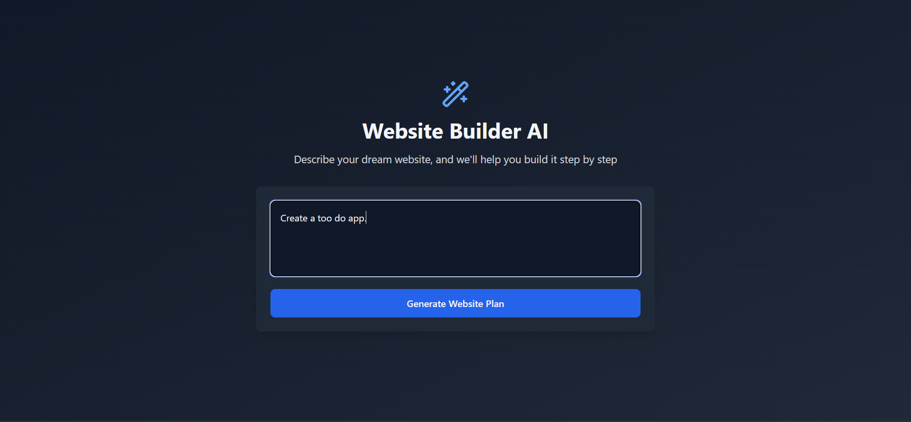

# AI-Powered Website Generator

[](https://opensource.org/licenses/MIT)

## Description

An innovative AI-powered website generator that allows users to create web applications by providing natural language prompts. Leveraging advanced language models and web technologies, this tool transforms user descriptions into fully functional React-based websites with intelligent step-by-step generation.

## Table of Contents

- [Features](#features)

- [Demo](#demo)

- [Technologies Used](#technologies-used)

- [Installation](#installation)

- [Usage](#usage)

- [How It Works](#how-it-works)

- [Contributing](#contributing)

- [License](#license)

- [Screenshots](#screenshots)

## Features

- Generate websites from natural language prompts

- Real-time step-by-step website creation process

- Interactive file explorer and code editor

- Live preview of generated website

- WebContainer-based instant development environment

- Iterative design and refinement through conversation

## Demo

- **Live Demo**: Click [here](https://website-generator-kr.vercel.app/) to view the live demo.

## Technologies Used

- Frontend:

- React: JavaScript library for building user interfaces

- TypeScript: Typed JavaScript for enhanced developer experience

- Tailwind CSS: Utility-first CSS framework

- React Router: Routing library

- Vite: Next-generation frontend tooling

- Backend:

- AI Integration: Language Model API

- WebContainer: Instant browser-based development environment

- Axios: HTTP client for API communications

- Development Tools:

- WebContainer API

- React Hooks

- Custom parsing and file generation logic

## Installation

1. Clone the repository:

   ```bash
   git clone https://github.com/Kartik-Rao11/website_generator.git
   ```

2. Change to project directory:

   ```bash
   cd website_generator
   ```

3. Install Frontend Dependencies:

   ```bash
   cd frontend
   npm install
   ```

4. Install Backend Dependencies:

   ```bash
   cd ../be
   npm install
   ```

5. Set up Environment Variables:
   Backend:

   ```bash
   cd ../backend
   cp .env.example .env
   # Edit backend .env with your configuration
   ```

6. Start Frontend Development Server:

   ```bash
   cd ../frontend
   npm run dev
   ```

7. Start Backend Server:
   ```bash
   cd ../backend
   npm run start
   ```

## Usage

1. Start the development server:

```bash

npm run dev

```

2. Open `http://localhost:5173` in your browser

3. Enter a website description in the prompt box

- Example: "Create a landing page for a coffee shop"

- Example: "Build a portfolio website for a photographer"

## How It Works

1. Enter a natural language prompt describing your desired website

2. AI analyzes the prompt and generates initial website structure

3. Step-by-step creation process with real-time updates

4. Interactive file explorer and live code preview

5. Refine and iterate on the generated website

## Contributing

Contributions are welcome! Please follow these steps:

1. Fork the repository

2. Create your feature branch (`git checkout -b feature/AmazingFeature`)

3. Commit your changes (`git commit -m 'Add some AmazingFeature'`)

4. Push to the branch (`git push origin feature/AmazingFeature`)

5. Open a Pull Request

## License

This project is licensed under the MIT License - see the [LICENSE](LICENSE) file for details.

## Screenshots

### Website Generation Interface



### Step-by-Step Creation Process


### Live Code Preview


